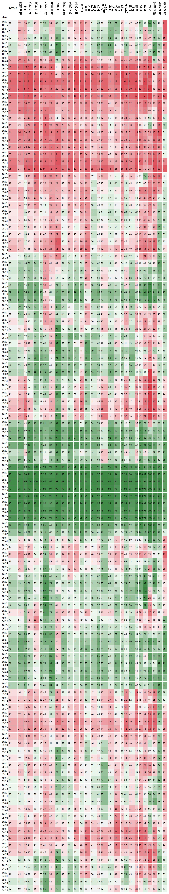

# Market-Breadth

计算美股、A股市场宽度

### 数据格式
使用 MySQL 存储数据，目前美股和A股各有两张表，具体表接口参加 config/sql/xxx.sql 文件，以A股为例：
zh_stocks_info: 股票基础数据：
```SQL
CREATE TABLE `zh_stocks_info` (
  `code` varchar(255) CHARACTER SET utf8mb4 COLLATE utf8mb4_0900_ai_ci NOT NULL COMMENT '代码',
  `ts_code` varchar(255) CHARACTER SET utf8mb4 COLLATE utf8mb4_0900_ai_ci DEFAULT NULL COMMENT 'tushare 股票代码',
  `name` varchar(255) CHARACTER SET utf8mb4 COLLATE utf8mb4_0900_ai_ci DEFAULT NULL COMMENT '股票名称',
  `sector` varchar(255) CHARACTER SET utf8mb4 COLLATE utf8mb4_0900_ai_ci DEFAULT NULL COMMENT '所在板块',
  `industry` varchar(255) CHARACTER SET utf8mb4 COLLATE utf8mb4_0900_ai_ci DEFAULT NULL COMMENT '所在行业',
  `sw_ind1` varchar(255) CHARACTER SET utf8mb4 COLLATE utf8mb4_0900_ai_ci DEFAULT NULL COMMENT '申万一级行业',
  `sw_ind1_weight` decimal(20,3) DEFAULT NULL COMMENT '申万一级行业权重',
  `area` varchar(255) CHARACTER SET utf8mb4 COLLATE utf8mb4_0900_ai_ci DEFAULT NULL COMMENT '地区',
  `market` varchar(255) CHARACTER SET utf8mb4 COLLATE utf8mb4_0900_ai_ci DEFAULT NULL COMMENT '市场',
  `list_date` varchar(10) CHARACTER SET utf8mb4 COLLATE utf8mb4_0900_ai_ci DEFAULT NULL COMMENT '上市时间',
  `total_cap` bigint DEFAULT NULL COMMENT '总市值',
  `pe` decimal(20,3) DEFAULT NULL COMMENT 'PE',
  `inst_percent` decimal(20,3) DEFAULT NULL,
  PRIMARY KEY (`code`) USING BTREE
) ENGINE=InnoDB DEFAULT CHARSET=utf8mb4 COLLATE=utf8mb4_0900_ai_ci;
```
zh_stocks_d: 日周期数据：
```SQL 
CREATE TABLE `zh_stocks_d` (
  `date` varchar(30) CHARACTER SET utf8mb4 COLLATE utf8mb4_0900_ai_ci NOT NULL COMMENT '日期',
  `code` varchar(20) CHARACTER SET utf8mb4 COLLATE utf8mb4_0900_ai_ci NOT NULL COMMENT '代码',
  `name` varchar(255) CHARACTER SET utf8mb4 COLLATE utf8mb4_0900_ai_ci DEFAULT NULL COMMENT '名称',
  `industry` varchar(255) CHARACTER SET utf8mb4 COLLATE utf8mb4_0900_ai_ci DEFAULT NULL COMMENT '行业',
  `sw_ind1` varchar(255) CHARACTER SET utf8mb4 COLLATE utf8mb4_0900_ai_ci DEFAULT NULL COMMENT '申万一级行业',
  `sw_ind1_weight` decimal(20,3) DEFAULT NULL COMMENT '申万一级行业权重',
  `area` varchar(255) CHARACTER SET utf8mb4 COLLATE utf8mb4_0900_ai_ci DEFAULT NULL COMMENT '地区',
  `market` varchar(255) CHARACTER SET utf8mb4 COLLATE utf8mb4_0900_ai_ci DEFAULT NULL COMMENT '市场',
  `open` decimal(20,3) DEFAULT NULL COMMENT '开盘价',
  `high` decimal(20,3) DEFAULT NULL COMMENT '最高价',
  `low` decimal(20,3) DEFAULT NULL COMMENT '最低价',
  `close` decimal(20,3) DEFAULT NULL COMMENT '收盘价',
  `pre_close` decimal(20,3) DEFAULT NULL COMMENT '前一天收盘价',
  `is_gap` varchar(10) CHARACTER SET utf8mb4 COLLATE utf8mb4_0900_ai_ci DEFAULT NULL COMMENT '是否有缺口',
  `vol` bigint DEFAULT NULL COMMENT '成交量',
  `ma_vol` bigint DEFAULT NULL COMMENT '月均成交量',
  `vol_rate` decimal(20,3) DEFAULT NULL COMMENT '成交量/月均量',
  `amount` bigint DEFAULT NULL COMMENT '成交额',
  `ma_amt` bigint DEFAULT NULL COMMENT '月（）均成交额',
  `amt_rate` decimal(20,3) DEFAULT NULL COMMENT '成交额/月均额',
  `s_ma` decimal(20,3) DEFAULT NULL COMMENT 'MA20',
  `m_ma` decimal(20,3) DEFAULT NULL COMMENT 'MA60',
  `l_ma` decimal(20,3) DEFAULT NULL COMMENT 'MA120',
  `s_ema` decimal(20,3) DEFAULT NULL COMMENT 'EMA20',
  `m_ema` decimal(20,3) DEFAULT NULL COMMENT 'EMA60',
  `l_ema` decimal(20,3) DEFAULT NULL COMMENT 'EMA120',
  `cs` decimal(20,3) DEFAULT NULL COMMENT 'C/S',
  `pcs` decimal(20,3) DEFAULT NULL COMMENT '前一日 C/S',
  `is_cs_over` varchar(10) CHARACTER SET utf8mb4 COLLATE utf8mb4_0900_ai_ci DEFAULT NULL COMMENT '是否破线（上穿）',
  `sm` decimal(20,3) DEFAULT NULL COMMENT 'S/M',
  `psm` decimal(20,3) DEFAULT NULL COMMENT '前一日 S/M',
  `is_sm_over` varchar(10) CHARACTER SET utf8mb4 COLLATE utf8mb4_0900_ai_ci DEFAULT NULL COMMENT '是否交叉(MA20上穿MA60)',
  `ml` decimal(20,3) DEFAULT NULL COMMENT 'M/L',
  `pml` decimal(20,3) DEFAULT NULL COMMENT '前一日 M/L',
  `is_ml_over` varchar(10) CHARACTER SET utf8mb4 COLLATE utf8mb4_0900_ai_ci DEFAULT NULL COMMENT '是否交叉(MA60上穿MA120)',
  `bais` decimal(20,3) DEFAULT NULL COMMENT 'C/S+S/M+M/L',
  `ecs` decimal(20,3) DEFAULT NULL COMMENT 'EMA C/S',
  `esm` decimal(20,3) DEFAULT NULL COMMENT 'EMA S/M',
  `pesm` decimal(20,3) DEFAULT NULL COMMENT '前一日 EMA S/M',
  `is_esm_over` varchar(10) CHARACTER SET utf8mb4 COLLATE utf8mb4_0900_ai_ci DEFAULT NULL COMMENT '是否交叉(EMA20上穿EMA60)',
  `eml` decimal(20,3) DEFAULT NULL COMMENT 'EMA M/L',
  `peml` decimal(20,3) DEFAULT NULL COMMENT '前一日 EMA M/L',
  `is_eml_over` varchar(10) CHARACTER SET utf8mb4 COLLATE utf8mb4_0900_ai_ci DEFAULT NULL COMMENT '是否交叉(EMA60上穿EMA120)',
  `ebais` decimal(20,3) DEFAULT NULL COMMENT 'EMA C/S+S/M+M/L',
  `s_close` decimal(20,3) DEFAULT NULL COMMENT 'MA20 抵扣价 ',
  `s_pre_close` decimal(20,3) DEFAULT NULL COMMENT 'MA21 抵扣价 ',
  `is_s_up` varchar(10) CHARACTER SET utf8mb4 COLLATE utf8mb4_0900_ai_ci DEFAULT NULL COMMENT 'MA20 是否向上拐头',
  `m_close` decimal(20,3) DEFAULT NULL COMMENT 'MA60 抵扣价 ',
  `m_pre_close` decimal(20,3) DEFAULT NULL COMMENT 'MA61 抵扣价 ',
  `is_m_up` varchar(10) CHARACTER SET utf8mb4 COLLATE utf8mb4_0900_ai_ci DEFAULT NULL COMMENT 'MA60 是否向上拐头',
  `l_close` decimal(20,3) DEFAULT NULL COMMENT 'MA120 抵扣价 ',
  `l_pre_close` decimal(20,3) DEFAULT NULL COMMENT 'MA121 抵扣价 ',
  `is_l_up` varchar(10) CHARACTER SET utf8mb4 COLLATE utf8mb4_0900_ai_ci DEFAULT NULL COMMENT 'MA120 是否向上拐头',
  PRIMARY KEY (`date`,`code`) USING BTREE
) ENGINE=InnoDB DEFAULT CHARSET=utf8mb4 COLLATE=utf8mb4_0900_ai_ci;
```

安装好 mysql 并在 mysql 中运行 config/sql 目录下的文件可以创建好自己的底层表。

另外需要让创建用户并授权，这里密码采用 `123456` ， 自行修改并修改配置文件 config/config.conf 中的配置项：
```SQL
ALTER USER 'stocks'@'%' IDENTIFIED WITH mysql_native_password BY '123456';
grant all privileges on  *.* to 'stocks'@'%';
```

### 数据获取
A 股使用 Tushare 获取，欢迎使用 https://tushare.pro/register?reg=275414 注册邀请链接帮我加积分。
```python 
    pip install tushare
```
美股使用 yfinance 获取：
```python 
    pip install yfinance
```
其他库依赖：
+ opendatatools
+ requests
+ bs4
+ pandas
+ TA-Lib

遇到什么安装什么即可。。。

### 运行分析
#### 1. 获取 A 股市场宽度
+ 1. 获取 A 股全市场股票基本信息：
```python   
    python task/zh_get_info.py
```
+ 2. 计算 A 股市场宽度图表：
```python   
    python task/zh_get_daily.py
```
获取数据时间比较久，请耐心等待，预计 1-2 个小时。
+ 3. 示例：
<div align="center">
	
</div>

#### 1. 获取 美股标普500 市场宽度
注意：美股数据获取最好使用科学上网。
+ 1. 获取美股全市场股票基本信息：
```python   
    python task/us_get_info.py
```
+ 2. 计算 美股标普500 市场宽度图表：
```python   
    python task/us_get_daily.py
```
获取数据时间比较久，请耐心等待，预计 1-2 个小时。
+ 3. 美股示例在 `data/Market-Breadth-US.jpg`

#### 惊喜：
在计算过程中该程序已经计算了全市场股票的 破线、交叉、拐头 等数据，您可以用 sql 在 mysql 中自行分析。

#### 如果觉得对您有帮助，欢迎请我喝杯咖啡：

+ 微信：
<div>
	
</div>

+ 支付宝：
<div>
	
</div>